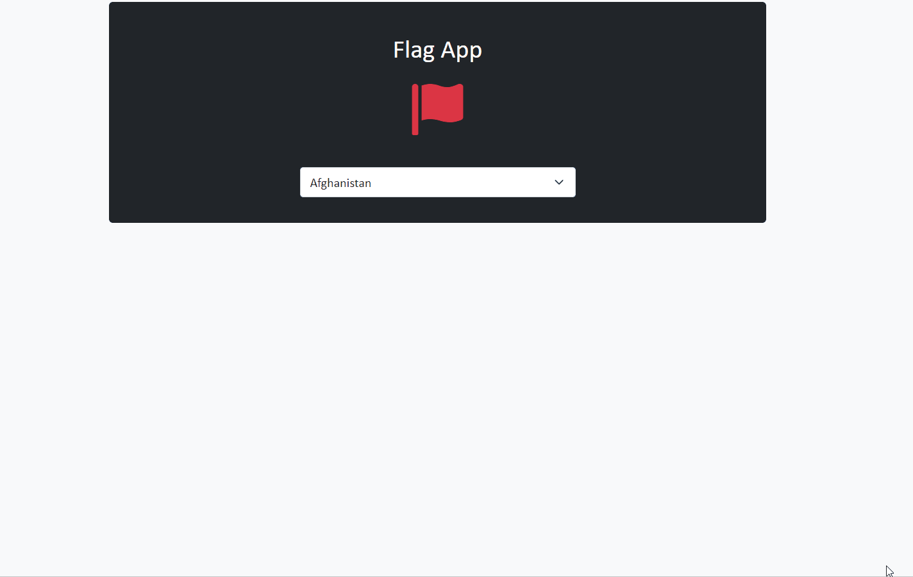

# jQuery-flag-app

## Objective

- In order to improve my knowledge of jQuery, which I have been trying to learn recently, I tried to do the Flag App project, which I had done with Vanilla Javascript, this time with jQuery.

## Description

- In this project I made a simple Flag App with jQuery.
- After selecting the country from the dropdown list, you can see the relevant country's flag, capital, region, language and currency information.
- I use fetch API for getting data from `https://restcountries.com/v3.1/all` and Bootstrap 5 for styling .

## Project Link

##### You can reach my project from [here](https://jquery-flag-app.vercel.app/) 👈

### Built With

- HTML
- CSS
- JS
- jQuery
- Ajax 
- Rest Countries API
- Bootstrap 

### Project Skeleton

```
jQuery-flag-app (folder)
|── README.md
SOLUTION
├── assets
│      ├── images
│      │      └── favicon.png
│      ├── app.js
│      └── style.css
└── index.html
```

### Installation

```
$ git clone https://github.com/esadakman/jQuery-flag-app.git
$ cd jQuery-flag-app
```

- Open the project with VS Code or other IDE's

### Preview of the Project


